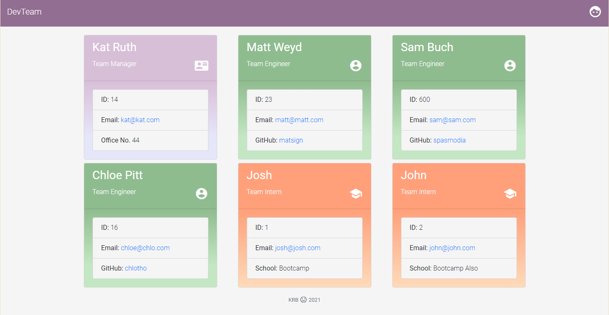
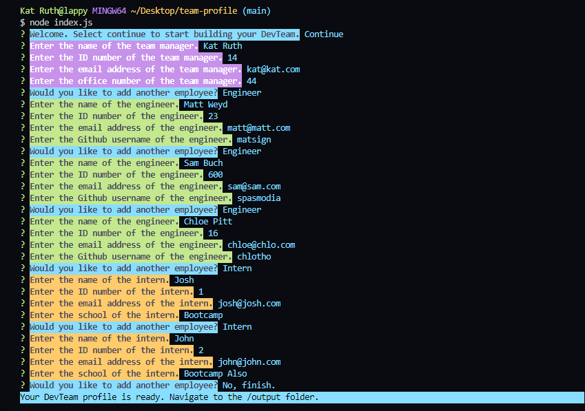

# DevTeam Profile Generator :email:

### This commandline application generates a styled webpage containing your development team's contact info and professional roles.

## *Table of Contents*

- [Description](#description)
- [Installation](#installation)
- [Usage](#usage)
- [Screenshots](#screenshots)
- [Contributing](#contributing)
- [Tests](#tests)
- [Questions](#questions)

## *Description*
DETAILED

## *Installation*
INSTALL

## *Usage*
USAGE

## *Screenshots*

## *Contributing*
This project is open source so feel free to take it and run with it.

## *Tests*
tests

## *Questions?*
- My Profile: [katsign](https://github.com/katsign)

---
This project is MIT licensed. &copy; 2021