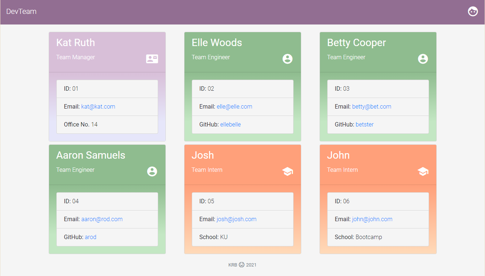
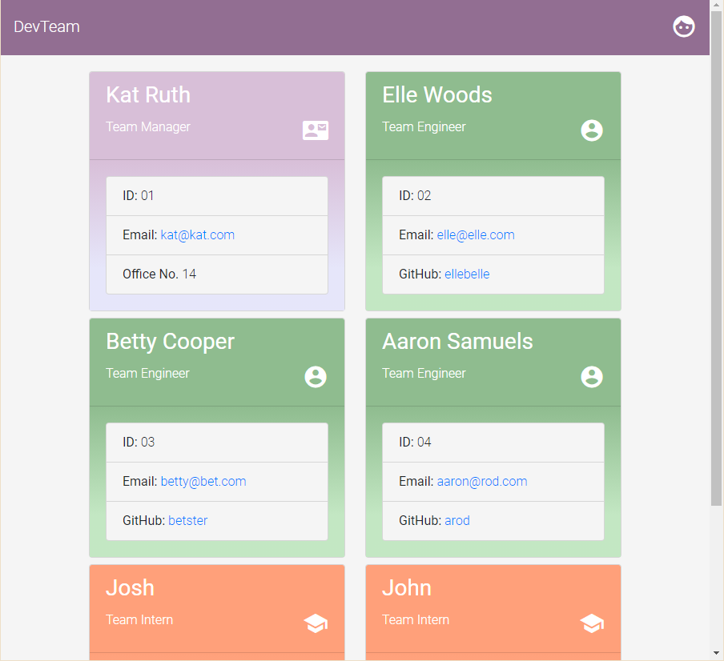
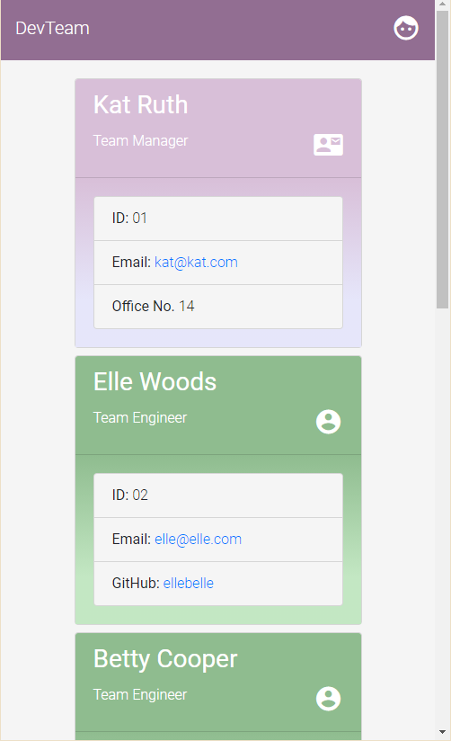

# DevTeam Profile Generator :email:

### This commandline application generates a styled webpage containing your development team's contact info and professional roles.

## *Table of Contents*

- [Description](#description)
- [Installation](#installation)
- [Usage](#usage)
- [Screenshots](#screenshots)
- [Contributing](#contributing)
- [Tests](#tests)
- [Questions](#questions)

## *Description*
Keep track of your development team's contact information using this simple color-coded interface, no coding involved. Simply invoke the app on the command line and plug in your information through a series of prompts — behind the scenes, DevTeam whips up a styled HTML page ready for deployment to your team. You'll need to follow the installation steps below to get going.

## *Installation*
### Navigate into the repository folder on your local machine and open the built-in terminal. You will need Node.js installed to run this application.
- On the command line, type `npm i` to pull the app's dependencies to your local. If this action is successful, a `node_modules` folder will appear in the root folder.
- Now, you can type `node index.js` to start the application.

## *Usage*
### This video demonstrates the full functionality and testing of this app: [link](path)
- The application begins with a Start menu. Select `'Continue'` to trigger the Inquirer prompts and begin adding the information for the `Team Manager`.
- You will then be prompted to `'Add another employee?'` to which you can either choose to `'Add Engineer'` or `'Add Intern,'` or opt to `'No, finish.'`
- When you are finished adding employees and choose `'No, finish.'` a message displays in the command line pointing you to the `/dist` folder.
- This is where your output `index.html` and `style.css` files will be! :star:

## *Screenshots*

Responsive Flex Breakpoint            |  Queried Flex-Direction Switch
:-------------------------:|:-------------------------:
  |  

## *Contributing*
Contributing is welcome, raise issues and submit through pull requests.

## *Tests*
ADD TEST SS

## *Questions?*
- My Profile: [katsign](https://github.com/katsign)

---
This project is MIT licensed. © 2021